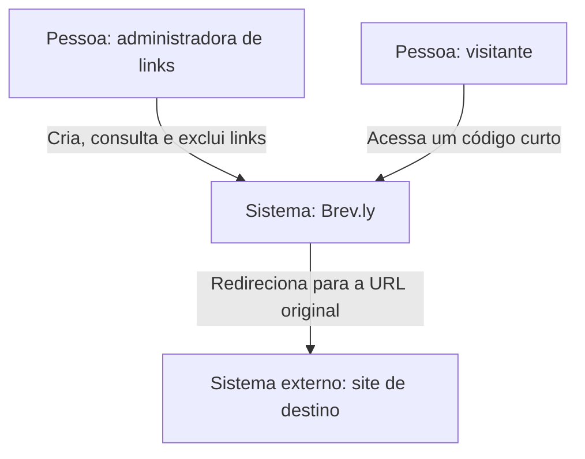
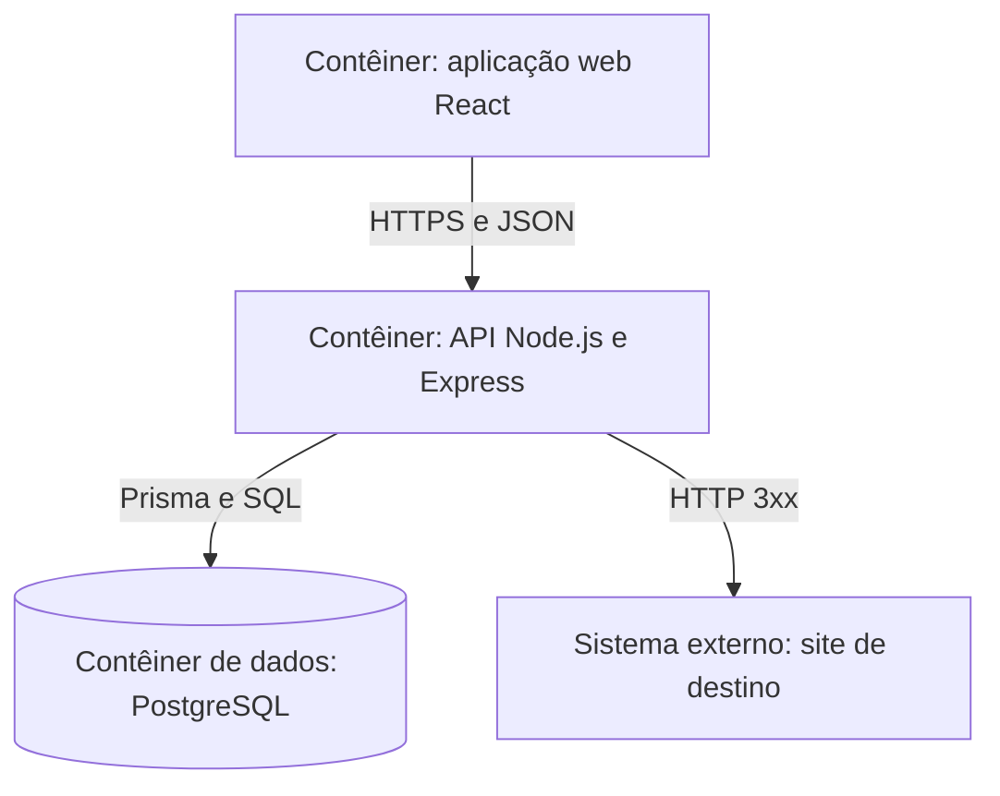
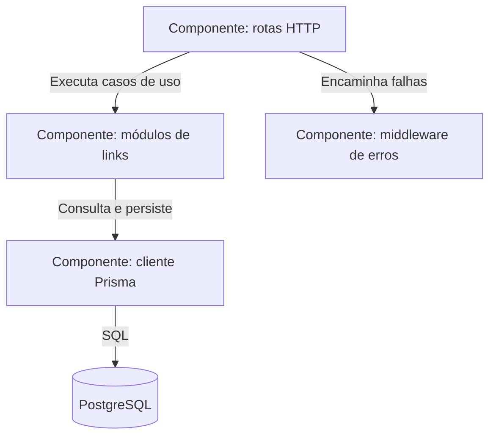
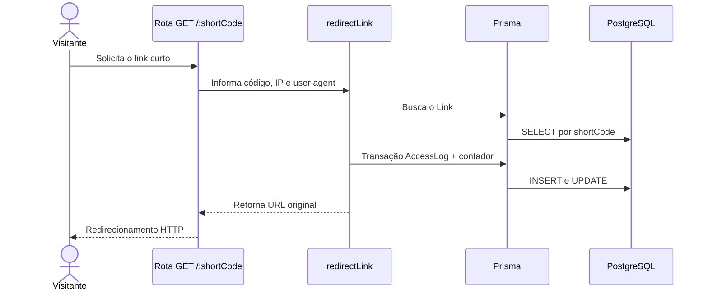

# Brev.ly — C4 Model

[README](../../README.md) · [Português](#português) · [English](#english)

Documentação baseada no código do repositório em 20 de setembro de 2026.  
Architecture documentation based on the repository code as of September 20, 2026.

## Português

### Nível 1 — Contexto do sistema

O Brev.ly recebe URLs longas de uma pessoa administradora e entrega links curtos que podem ser acessados por visitantes.

### Nível 2 — Contêineres

### Nível 3 — Componentes da API

### Fluxo principal — redirecionamento

## English

### System context

Brev.ly lets a link administrator create and manage short URLs. Visitors use those URLs and are redirected to external destination websites.

### Containers

The React web application communicates with the Node.js/Express API over JSON. The API persists links and access logs in PostgreSQL through Prisma and performs HTTP redirects.

### API components

HTTP routes adapt incoming requests, link modules implement the use cases, Prisma isolates database access, and the global error middleware translates failures into HTTP responses.

### Key decisions and boundaries

- The browser never accesses PostgreSQL directly.
- Short-code uniqueness is enforced both during generation and by a database constraint.
- Redirect metrics are recorded atomically with a Prisma transaction.
- `AccessLog` rows are deleted automatically when their parent `Link` is removed.
- External destination websites are outside the Brev.ly trust boundary.

## Evolution notes

Authentication, rate limiting, automated tests, pagination and production observability should be added before treating the service as production-ready.
